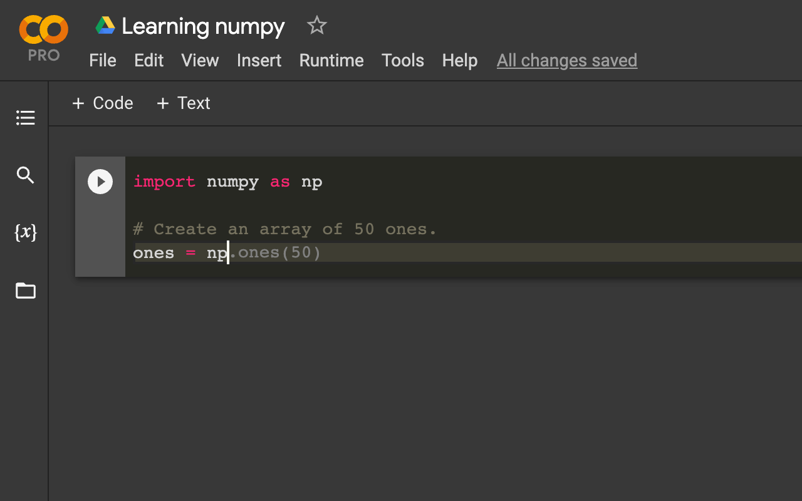
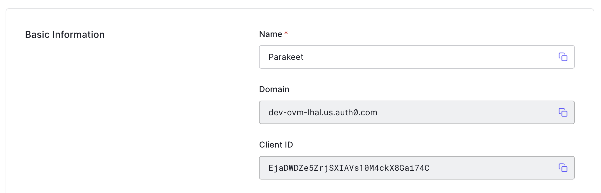
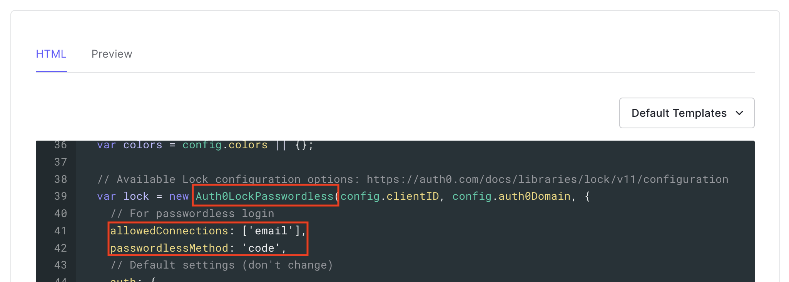

Parakeet is like [Copilot](https://copilot.github.com/), but for Colab and Jupyter notebooks. It's implemented as a small Chrome extension.



# Installing the extension

- First, build it:

```
cd extension/
yarn install
yarn build
```

- Then load the `dist` directory as a Chrome extension using `Load unpacked`
- Create an account or sign in
- Open any Colab or Jupyter notebook and start typing!

# Hosting Parakeet yourself

To host Parakeet yourself, you'll need access to OpenAI's private beta of Codex. If you do have access, you can deploy Parakeet by following these steps:

## Set up Auth0

Parakeet uses Auth0 as the authentication provider. You'll need to create an Auth0 account and set it up.

- First make sure you have an Auth0 account. Then on your [Auth0 dashboard](https://manage.auth0.com/):
- Create an application and write down the "Domain" and "Client ID".



- In the Auth0 settings, set the `Allowed Callback URLs` to `chrome-extension://linkknplelcdbncponjdhcjdknlpgghc/options_auth0.915298d6.html`
  - The hash is generated by Parcel using the `--no-content-hash` flag. It depends only on the file path of `options_auth0.html`, so it should only change if the file is renamed or moved.
- Set the `Allowed Web Origins` to `chrome-extension://linkknplelcdbncponjdhcjdknlpgghc`
- Also set the Allowed Logout URLs to `chrome-extension://linkknplelcdbncponjdhcjdknlpgghc/options_auth0.915298d6.html?logout-true`
- In the APIs section of the Auth0 dashboard, create an API with `codex-proxy` as the identifier.

### Passwordless auth flow

Optionally, you can use a "passwordless" auth flow to let users sign in with their email address only.

- **Enable the flow.** Go to `Authentication > Passwordless` in the Auth0 dashboard and enable passwordless email authentication for the Parakeet application. (After the dialog opens, make sure to go to the `Applications` tab and enable it for the Parakeet application specifically.)
- **Configure the login screen.** Go to `Branding > Universal Login > Advanced Options > Login` and enable `Customize Login Page`. Then make the following changes to the code, as specified in Auth0's [documentation](https://auth0.com/docs/libraries/lock#passwordless-options).
  - Swap out the `Auth0Lock` constructor for `Auth0LockPasswordless`.
  - Add `allowedConnections: ['email']` and `passwordlessMethod: 'code'` to the `Auth0LockPasswordless` config object.



## Deploy to fly.io

First, some preliminary steps:

- Set up a fly.io account and install the CLI by following the instructions [here](https://fly.io/docs/speedrun/)
- Come up with a password for Redis and write it down

Now, you can deploy Redis and the Node.js endpoint.

### Redis

In the `redis-rate-limiter` directory, do the following:

- Use `flyctl secrets import` to set a value for `REDIS_PASSWORD`
- Run `flyctl deploy`

### Node.js endpoint

In the `codex-endpoint` directory, do the following:

- Deploy the Node.js endpoint using `flyctl launch`
- Use `flyctl secrets import` to set the values for `REDIS_PASSWORD` and `OPENAI_API_KEY`
- Write down the URL of the API endpoint

## Set up `config.json`

- In the root directory of the repo, create a `config.json` file and set it up as follows. Note that the domain names must **not** include the `https://` prefix, or any suffix.

```
{
  "auth0_domain": (e.g. "dev-ovm-lhal.us.auth0.com"),
  "auth0_client_id": (e.g. "EjaDWDZe5ZrjSXIAVs10M4ckX8Gai74C"),
  "flyio_domain": (e.g. "dark-glade-5761.fly.dev")
}
```

- Finally, _copy_ `config.json` into both the `extension` directory and the `codex-proxy` directory.
